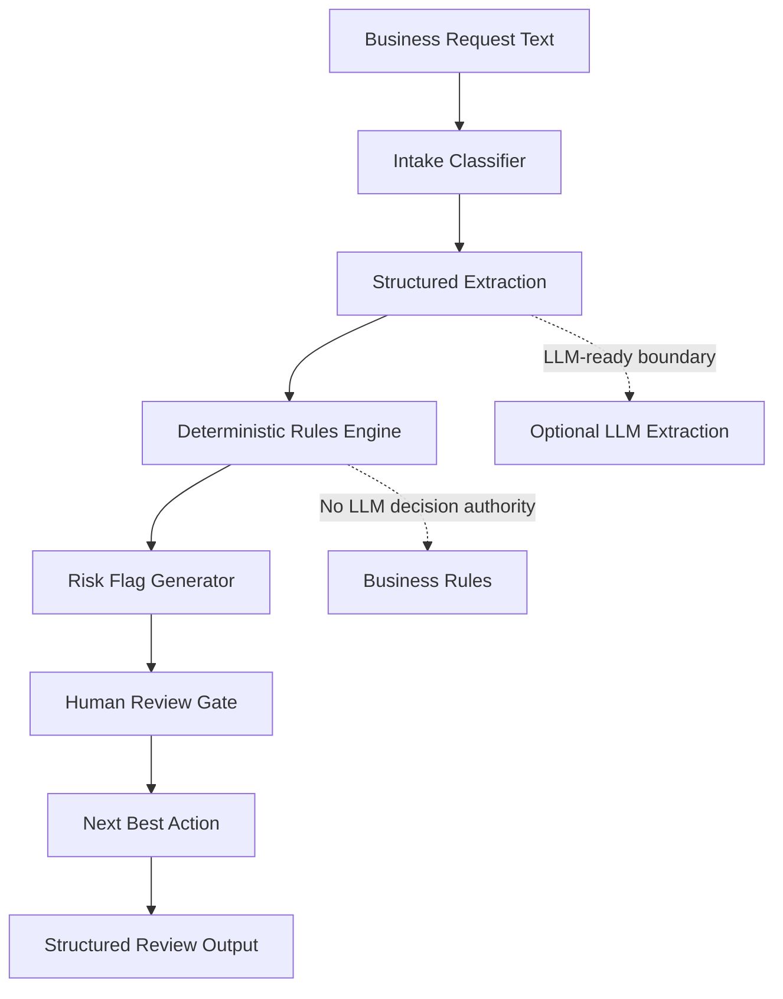

# Business Review AI Orchestration

AI workflow prototype for turning messy business requests into structured review outputs with rule-based validation, risk flags, and human review boundaries.

## Business Problem

Operations, compliance, insurance, customer success, and implementation teams often review requests that arrive as emails, forms, notes, contracts, or policy language. The work is repetitive but judgment-heavy: reviewers must identify the request type, extract important details, check for missing information, flag risk, and decide the next action.

When this process is handled manually, teams can face delays, inconsistent review quality, missed requirements, and rework.

## Solution

This project demonstrates a controlled AI-assisted workflow that separates flexible text interpretation from deterministic business rules. A document or request is processed through role-aware workflow steps:

- Intake classification
- Structured extraction
- Rule-based validation
- Risk flagging
- Human review routing
- Next-best-action recommendation
- Business-friendly output formatting

The project uses mock extraction logic so it can run locally without an API key. The architecture is designed so an LLM could later be added for the extraction step while keeping rules, thresholds, and human review controls deterministic.

## What This Demonstrates

- AI workflow design
- Business process automation
- Structured extraction from unstructured text
- Rule-based validation
- Risk flagging and escalation logic
- Human-in-the-loop review design
- Clear handoffs between AI reasoning and business rules
- Decision-support output design

## System Architecture



## How It Works

1. A user provides messy business request text.
2. The intake step classifies the request type.
3. The extraction step converts the text into structured fields.
4. The rules engine checks required information and deterministic business conditions.
5. The risk flag step identifies review concerns.
6. The workflow decides whether human review is required.
7. The formatter returns JSON that can be used in a dashboard, ticket, CRM, or review queue.

## Sample Input

```text
Client is requesting vendor onboarding approval for Northstar Claims Services.
They need access by June 15 for claims intake support. Contract language mentions
SOC 2, data handling, indemnification, and a 24-hour incident notice requirement.
Insurance limits were not included. The request asks for expedited approval.
```

## Sample Output

```json
{
  "document_type": "vendor_onboarding_request",
  "summary": "Vendor onboarding request for claims intake support with data handling and incident notice requirements.",
  "extracted_requirements": [
    "SOC 2 mentioned",
    "Data handling requirement mentioned",
    "Indemnification mentioned",
    "24-hour incident notice mentioned"
  ],
  "missing_information": [
    "insurance_limits",
    "business_owner",
    "effective_date"
  ],
  "risk_flags": [
    "Expedited approval requested",
    "Insurance limits missing",
    "Incident notice requirement requires review"
  ],
  "recommended_next_action": "Route to human reviewer before approval and request missing insurance limits, business owner, and effective date.",
  "confidence_level": "medium",
  "requires_human_review": true
}
```

## Run Locally

```bash
python -m src.demo
```

Run tests:

```bash
pip install -r requirements.txt
python -m pytest
```

## Project Structure

```text
business-review-ai-orchestration/
  README.md
  requirements.txt
  src/
    demo.py
    extraction.py
    intake.py
    orchestration.py
    output_formatter.py
    risk_flags.py
    rules_engine.py
    sample_data.py
  data/
    sample_business_request.txt
  outputs/
    sample_review_output.json
  docs/
    architecture.md
    business_case.md
    evaluation_notes.md
  tests/
    test_rules_engine.py
```

## Limitations and Human Review

This is a portfolio prototype, not a production compliance system. It does not make final approval decisions. High-risk, ambiguous, incomplete, or time-sensitive requests are routed to human review.

## Future Improvements

- Add a Streamlit interface for request review.
- Add optional OpenAI extraction behind an environment-variable API key.
- Store review history in SQLite.
- Add reviewer feedback loops.
- Add role-specific dashboards for operations, compliance, and account teams.
- Add evaluation examples showing precision of missing-info and risk-flag detection.
