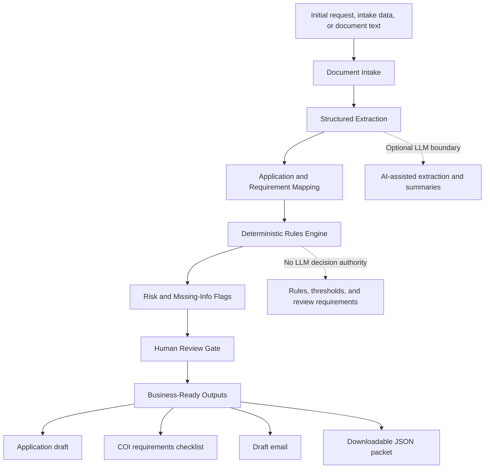

# SubmissionReady AI: Insurance Submission Review Workflow

AI-assisted insurance application preparation and submission review workflow that takes an initial request and creates a submission-ready packet for human review.

## Disclaimer

This is an independent portfolio project built for learning and demonstration purposes.

It uses mock data, sample business scenarios, and synthetic insurance/application examples. It does not include employer data, client data, proprietary workflows, carrier-specific confidential information, or internal company tools.

The project is designed to demonstrate applied AI, business analytics, document review, and human-in-the-loop workflow design.

## Business Problem

Business, insurance, compliance, and service teams often need to turn intake notes, emails, contracts, COI requests, and application forms into accurate review packets. The work is repetitive but judgment-heavy: reviewers must identify what the request is asking for, extract important requirements, check what is missing, flag complex wording, and prepare the next action.

When this process is handled manually, teams can face delays, inconsistent review quality, missed requirements, unclear handoffs, and rework before a file is ready for submission or service follow-up.

## Solution

SubmissionReady AI demonstrates a controlled AI-assisted workflow for document review, application preparation, requirement extraction, and decision-support workflows. It converts intake data into structured outputs while keeping deterministic business rules, source evidence, review flags, and human approval boundaries separate from AI-assisted interpretation.

The project uses mock extraction logic so it can run locally without an API key. The architecture is designed so an LLM could later be added for extraction and summarization while rules, review gates, and final decisions stay controlled.

## SubmissionReady AI Use Case

The main demo prepares a restaurant / liquor liability insurance application review packet from fake intake data. It does not submit anything automatically. It gives the rep a structured draft, flags inferred answers for review, identifies missing information, decodes certificate or contract wording, and creates draft follow-up language.

The workflow can:

- upload or paste fake intake data
- attach a carrier application PDF for reference and tracking
- upload a preprocessed form-question schema
- infer likely application answers from intake and account data
- show the application draft before save/export
- flag inferred answers that need rep review
- identify missing application fields
- decode COI and contract insurance requirements
- create CSR certificate request drafts
- create quote-prep review flags for complex wording
- require human review before any carrier-facing action

This repository does not copy or recreate any official carrier form. It shows the workflow pattern: intake, extraction, field mapping, missing-information detection, requirement review, and human approval.

## What This Demonstrates

- AI workflow design for business and insurance operations
- AI-assisted document review and application preparation
- Structured extraction from intake notes, contracts, and COI requests
- Rule-based validation and missing-information detection
- Requirement extraction for additional insured, waiver of subrogation, primary/noncontributory wording, limits, and certificate holder details
- Human-in-the-loop review gates for inferred or ambiguous answers
- Source-aware and auditable output design
- Business-ready summaries, checklists, draft emails, and JSON review packets
- Clear boundaries between AI-assisted interpretation and deterministic business logic

## System Architecture



## How It Works

1. A user provides an initial business, quote, certificate, or application request.
2. The intake step classifies the request type and normalizes available information.
3. The extraction step converts text into structured fields.
4. The mapping step aligns fields to application questions and review categories.
5. The rules engine checks required information and deterministic business conditions.
6. The risk flag step identifies complex wording, missing information, and rep review items.
7. The human review gate requires flagged inferred answers to be checked before save/export.
8. The formatter returns a review packet that can support a dashboard, ticket, CRM workflow, or carrier submission-prep process.

## Sample Input / Sample Output

### Restaurant Insurance Application Prep

Sample input:

```text
Restaurant/bar account requesting GL, liquor liability, property, and business income coverage.
Operations include dine-in service, beer/wine/liquor sales, live music twice per month, and late-night hours.
The request includes a landlord certificate request with additional insured, waiver of subrogation,
and primary/noncontributory wording.
```

Sample output:

```json
{
  "workflow_name": "liquor_restaurant_submission_prep",
  "document_type": "restaurant_insurance_application_prep",
  "submission_readiness": "needs_rep_review",
  "application_answers": [
    {
      "question": "Does the applicant sell alcoholic beverages?",
      "answer": "Yes",
      "source": "intake_notes",
      "inferred": true,
      "flagged_for_review": true,
      "review_note": "Confirm liquor sales percentage before submission."
    }
  ],
  "requires_human_review": true
}
```

### COI Requirements Decoder

Sample input:

```text
Certificate holder requests additional insured status, waiver of subrogation,
primary and noncontributory wording, and 30 days notice of cancellation.
```

Sample output:

```json
{
  "requirement_type": "certificate_requirements",
  "flags": [
    "additional_insured_requested",
    "waiver_of_subrogation_requested",
    "primary_noncontributory_wording_requested",
    "notice_of_cancellation_wording_requested"
  ],
  "recommended_review": "Route wording to rep or account manager before quoting and certificate issuance."
}
```

### Missing-Information Checklist

Sample output:

```json
{
  "missing_information": [
    "effective_date",
    "full certificate holder address",
    "liquor sales percentage",
    "requested limits",
    "prior carrier and loss history"
  ],
  "next_action": "Request missing details before preparing a carrier-ready submission packet."
}
```

### Draft Email Output

Sample output:

```text
Hi,

Thank you for sending the restaurant quote request. Before we prepare the carrier submission packet,
please confirm the requested effective date, liquor sales percentage, requested limits, prior carrier,
loss history, and the full certificate holder address.

We also noted certificate wording for additional insured, waiver of subrogation, and primary/noncontributory
status. Those items should be reviewed before quoting and certificate issuance.
```

## Liquor / Restaurant Quote Intake Example

SubmissionReady AI includes fake Salesforce-style account data, fake restaurant quote intake notes, and a preprocessed form-question JSON schema. The browser demo lets the user upload intake data, upload a question schema, attach a carrier application PDF for reference, preview inferred answers, check flagged answers as reviewed, and download the generated JSON review packet.

Current scope:

- creates an application-prep packet
- maps answers to target PDF field names when available
- previews answers before save/export
- gates save/export behind rep review of flagged answers
- includes certificate requirements in the quote-prep flags
- creates a CSR certificate request draft when certificate wording is included

Next backend step:

- physically fill PDF form fields after the form is mapped and reviewed

## Run Locally

Run the polished Next.js interface:

```bash
cd web
npm install
npm run dev
```

Run the Python command-line demo from the repository root:

```bash
python -m src.demo
```

Run tests:

```bash
python -m pytest
```

## Project Structure

```text
business-review-ai-orchestration/
  README.md
  requirements.txt
  web/
    app/
    lib/
    package.json
  src/
    demo.py
    demo_application.py
    demo_liquor_restaurant.py
    application_packet.py
    extraction.py
    intake.py
    liquor_restaurant_packet.py
    orchestration.py
    output_formatter.py
    risk_flags.py
    rules_engine.py
    sample_data.py
  data/
    fake_salesforce_liquor_restaurant_account.json
    liquor_restaurant_form_questions.json
    sample_business_request.txt
    sample_liquor_restaurant_quote_request.txt
    sample_generic_application_notes.txt
  outputs/
    sample_liquor_restaurant_packet.json
    sample_review_output.json
    sample_generic_application_packet.json
  docs/
    architecture.md
    aws_deployment.md
    business_case.md
    evaluation_notes.md
  tests/
    test_application_packet.py
    test_liquor_restaurant_packet.py
    test_rules_engine.py
```

## Limitations and Human Review

This is a portfolio prototype, not a production compliance system, licensed insurance tool, official carrier application system, legal advice, insurance advice, underwriting decision tool, or certificate issuance system. It does not make final approval, coverage, compliance, legal, underwriting, or submission decisions.

All sample data is fake. Any high-risk, ambiguous, incomplete, inferred, or carrier-facing output should be reviewed by a qualified human before use.

## Future Improvements

- Add optional OpenAI extraction behind an environment-variable API key.
- Add physical PDF form filling after reviewed field mappings.
- Add a Python API layer with FastAPI or AWS Lambda.
- Store review history in SQLite or a managed database.
- Add reviewer feedback loops.
- Add role-specific dashboards for producers, CSRs, account managers, and operations teams.
- Add evaluation examples showing precision of missing-info and risk-flag detection.
